# 🏢 Sample Business Management System

A comprehensive demonstration of professional documentation with architecture diagrams for business management applications. This repository serves as a template for documenting Spring Boot applications with proper architectural visualization.

## 📋 Table of Contents

- [Overview](#overview)
- [Architecture](#architecture)
- [Features](#features)
- [Technology Stack](#technology-stack)
- [Getting Started](#getting-started)
- [API Documentation](#api-documentation)
- [Database Schema](#database-schema)
- [Contributing](#contributing)
- [License](#license)

## 🎯 Overview

This Sample Business Management System demonstrates best practices for technical documentation and architecture visualization. It showcases how to properly document software systems with professional Mermaid.js diagrams that provide clear insights into system architecture, data flows, and deployment strategies.

## 🏗️ Architecture

### 1. High-Level Interaction Diagram (Upstream / Downstream)

```mermaid
%%{init: {
  'theme': 'base',
  'themeVariables': {
    'primaryColor': '#f8fafc',
    'primaryTextColor': '#1e293b',
    'primaryBorderColor': '#64748b',
    'lineColor': '#94a3b8'
  }
}}%%

flowchart LR
    %% Upstream Systems
    subgraph "🔼 Upstream Systems"
        ERP[🏢 ERP System<br/>Master Data]:::upstream
        VENDOR[🏪 Vendor Portal<br/>Catalogs & Pricing]:::upstream
        AUTH[🔐 LDAP/AD<br/>User Authentication]:::upstream
    end

    %% Core Business System
    subgraph "🎯 Business Management System"
        PURCHASE[📦 Purchase Management]:::core
        SUPPLIER[🤝 Supplier Management]:::core
        INVENTORY[📊 Inventory Control]:::core
        USER[👤 User Management]:::core
    end

    %% Downstream Systems
    subgraph "🔽 Downstream Systems"
        FINANCE[💰 Financial System<br/>AP/GL Integration]:::downstream
        WMS[📦 Warehouse System<br/>Fulfillment]:::downstream
        REPORT[📈 BI/Reporting<br/>Analytics]:::downstream
        NOTIF[📧 Notification Service<br/>Alerts & Updates]:::downstream
    end

    %% Upstream Flows
    ERP -->|Master Data Sync| PURCHASE
    ERP -->|Product Catalog| INVENTORY
    VENDOR -->|Price Updates| SUPPLIER
    VENDOR -->|Availability| INVENTORY
    AUTH -->|User Validation| USER

    %% Downstream Flows
    PURCHASE -->|PO Data| FINANCE
    PURCHASE -->|Fulfillment Orders| WMS
    INVENTORY -->|Stock Levels| REPORT
    SUPPLIER -->|Performance Data| REPORT
    USER -->|Activity Logs| NOTIF

    %% Styling
    classDef upstream fill:#e3f2fd,stroke:#1565c0,stroke-width:2px,color:#0d47a1
    classDef core fill:#fff3e0,stroke:#ef6c00,stroke-width:2px,color:#bf360c
    classDef downstream fill:#e8f5e8,stroke:#2e7d32,stroke-width:2px,color:#1b5e20
```



### 2. Context Diagram

```mermaid
%%{init: {
  'theme': 'base',
  'themeVariables': {
    'primaryColor': '#f8fafc',
    'primaryTextColor': '#1e293b',
    'primaryBorderColor': '#64748b',
    'lineColor': '#94a3b8'
  }
}}%%

flowchart TD
    %% External Entities
    BUYER[👤 Purchase Manager<br/>Creates & Manages Orders]:::actor
    ADMIN[👨‍💼 System Admin<br/>User & Config Management]:::actor
    SUPPLIER_USER[🏪 Supplier<br/>External Vendor]:::external
    FINANCE_USER[💰 Finance Team<br/>Budget & Approval]:::actor

    %% Central System
    BMS[🏢 Business Management System<br/>Core Application]:::system

    %% External Systems
    EMAIL_SYS[📧 Email System]:::external
    PAYMENT_SYS[💳 Payment Gateway]:::external
    ERP_SYS[🏢 Enterprise System]:::external

    %% User Interactions
    BUYER -->|Create Purchase Orders| BMS
    BUYER -->|Track Order Status| BMS
    ADMIN -->|Manage Users & Suppliers| BMS
    FINANCE_USER -->|Approve & Budget Control| BMS

    %% System Interactions
    BMS -->|Order Notifications| EMAIL_SYS
    BMS -->|Payment Processing| PAYMENT_SYS
    BMS -->|Data Synchronization| ERP_SYS
    SUPPLIER_USER -->|Catalog & Pricing Updates| BMS

    %% Response Flows
    EMAIL_SYS -.->|Delivery Confirmations| BMS
    PAYMENT_SYS -.->|Transaction Status| BMS
    ERP_SYS -.->|Master Data Updates| BMS

    %% Styling
    classDef actor fill:#e8f5e8,stroke:#388e3c,stroke-width:2px,color:#1b5e20
    classDef system fill:#fff3e0,stroke:#f57c00,stroke-width:3px,color:#e65100
    classDef external fill:#f3e5f5,stroke:#7b1fa2,stroke-width:2px,color:#4a148c
```



### 3. Data Flow Diagram (DFD)

```mermaid
%%{init: {
  'theme': 'base',
  'themeVariables': {
    'primaryColor': '#f8fafc',
    'primaryTextColor': '#1e293b',
    'primaryBorderColor': '#64748b',
    'lineColor': '#94a3b8'
  }
}}%%

flowchart TD
    %% External Entities
    USER[👤 User]:::entity
    VENDOR[🏪 Vendor]:::entity
    FINANCE[💰 Finance Dept]:::entity

    %% Processes
    P1[📝 1.0<br/>Create Purchase Request]:::process
    P2[✅ 2.0<br/>Approve Purchase Order]:::process
    P3[📦 3.0<br/>Manage Inventory]:::process
    P4[📊 4.0<br/>Generate Reports]:::process

    %% Data Stores
    DS1[(🗄️ D1: Purchase Orders)]:::datastore
    DS2[(🗄️ D2: Suppliers)]:::datastore
    DS3[(🗄️ D3: Inventory)]:::datastore
    DS4[(🗄️ D4: Users)]:::datastore

    %% Data Flows
    USER -->|Purchase Request| P1
    P1 -->|PO Details| DS1
    DS1 -->|Pending POs| P2
    P2 -->|Approved PO| DS1
    DS1 -->|Order Info| VENDOR
    VENDOR -->|Delivery Confirmation| P3
    P3 -->|Stock Updates| DS3
    DS3 -->|Stock Levels| P1
    DS2 -->|Supplier Info| P1
    DS4 -->|User Permissions| P2
    P2 -->|Approval Status| FINANCE
    DS1 -->|Order Data| P4
    DS3 -->|Inventory Data| P4
    P4 -->|Reports| USER
    P4 -->|Analytics| FINANCE

    %% Styling
    classDef entity fill:#e0f2fe,stroke:#0277bd,stroke-width:2px,color:#01579b
    classDef process fill:#fff3e0,stroke:#f57c00,stroke-width:2px,color:#e65100
    classDef datastore fill:#f3e5f5,stroke:#7b1fa2,stroke-width:2px,color:#4a148c
```



### 4. Deployment Diagram

```mermaid
%%{init: {
  'theme': 'base',
  'themeVariables': {
    'primaryColor': '#f8fafc',
    'primaryTextColor': '#1e293b',
    'primaryBorderColor': '#64748b',
    'lineColor': '#94a3b8'
  }
}}%%

flowchart TB
    %% Client Tier
    subgraph "🖥️ Client Tier"
        BROWSER[🌐 Web Browser<br/>Chrome/Firefox/Safari]:::client
        MOBILE[📱 Mobile Browser<br/>Responsive UI]:::client
    end

    %% Load Balancer
    LB[⚖️ Load Balancer<br/>Nginx/Apache]:::infrastructure

    %% Application Tier
    subgraph "🏗️ Application Tier"
        subgraph "🖥️ App Server 1"
            APP1[☕ Spring Boot App<br/>Primary Instance<br/>Port: 8080]:::application
        end
        subgraph "🖥️ App Server 2"
            APP2[☕ Spring Boot App<br/>Secondary Instance<br/>Port: 8081]:::application
        end
    end

    %% Database Tier
    subgraph "🗄️ Database Tier"
        DB_PRIMARY[(💽 MySQL Primary<br/>Read/Write<br/>Port: 3306)]:::database
        DB_REPLICA[(📖 MySQL Replica<br/>Read Only<br/>Port: 3307)]:::database
    end

    %% External Services
    subgraph "🌐 External Services"
        EMAIL_SVC[📧 SMTP Server<br/>Email Service<br/>Port: 587]:::external
        PAYMENT_SVC[💳 Payment API<br/>HTTPS Gateway<br/>Port: 443]:::external
    end

    %% Monitoring & Logging
    subgraph "📊 Monitoring Tier"
        MONITOR[📈 Application Monitoring<br/>Actuator Endpoints]:::monitoring
        LOGS[📝 Log Aggregation<br/>Centralized Logging]:::monitoring
    end

    %% Connections
    BROWSER --> LB
    MOBILE --> LB
    LB --> APP1
    LB --> APP2
    APP1 --> DB_PRIMARY
    APP2 --> DB_PRIMARY
    APP1 --> DB_REPLICA
    APP2 --> DB_REPLICA
    DB_PRIMARY -.->|Replication| DB_REPLICA
    APP1 --> EMAIL_SVC
    APP2 --> EMAIL_SVC
    APP1 --> PAYMENT_SVC
    APP2 --> PAYMENT_SVC
    APP1 --> MONITOR
    APP2 --> MONITOR
    APP1 --> LOGS
    APP2 --> LOGS

    %% Deployment Annotations
    LB -.->|HTTP/HTTPS<br/>Port 80/443| APP1
    APP1 -.->|JDBC<br/>Port 3306| DB_PRIMARY

    %% Styling
    classDef client fill:#e8f5e8,stroke:#388e3c,stroke-width:2px,color:#1b5e20
    classDef infrastructure fill:#e0f2fe,stroke:#0277bd,stroke-width:2px,color:#01579b
    classDef application fill:#fff3e0,stroke:#f57c00,stroke-width:2px,color:#e65100
    classDef database fill:#ffebee,stroke:#d32f2f,stroke-width:2px,color:#b71c1c
    classDef external fill:#f3e5f5,stroke:#7b1fa2,stroke-width:2px,color:#4a148c
    classDef monitoring fill:#f5f5f5,stroke:#616161,stroke-width:2px,color:#424242
```



## ✨ Features

### 🛒 Purchase Management
- Create and manage purchase orders with approval workflows
- Track order status and fulfillment progress
- Automated supplier notifications and communications
- Cost analysis and reporting with budget controls

### 🏪 Supplier Management
- Comprehensive vendor database management
- Supplier performance tracking and scorecards
- Contract and pricing management with history
- Communication history and document storage

### 📦 Inventory Control
- Real-time stock level monitoring and alerts
- Automated reorder notifications based on thresholds
- Product catalog management with categories
- Warehouse location tracking and optimization

### 👥 User Management
- Secure authentication system with role-based access
- Multi-level approval workflows
- User profile management with permissions
- Activity audit logging for compliance

## 🛠️ Technology Stack

### Backend
- **Framework**: Spring Boot 2.7+
- **Language**: Java 11+
- **Database**: MySQL 8.0+
- **ORM**: Hibernate/JPA
- **Security**: Spring Security with JWT
- **Build Tool**: Maven 3.8+

### Frontend
- **Template Engine**: Thymeleaf 3.0+
- **Styling**: Bootstrap 5
- **JavaScript**: Vanilla JS/jQuery
- **Icons**: Font Awesome 6

### Infrastructure
- **Application Server**: Embedded Tomcat
- **Database**: MySQL with replication
- **Caching**: Redis (Optional)
- **Messaging**: RabbitMQ (Optional)
- **Monitoring**: Spring Boot Actuator

## 🚀 Getting Started

### Prerequisites
- Java 11 or higher
- Maven 3.6+
- MySQL 8.0+
- Git
- Docker (Optional)

### Installation

1. **Clone the repository**
   ```bash
   git clone https://github.com/GoyalSiddhi/sample-repo-one.git
   cd sample-repo-one
   ```

2. **Configure Database**
   ```sql
   CREATE DATABASE business_management;
   CREATE USER 'app_user'@'localhost' IDENTIFIED BY 'secure_password';
   GRANT ALL PRIVILEGES ON business_management.* TO 'app_user'@'localhost';
   FLUSH PRIVILEGES;
   ```

3. **Update Application Properties**
   ```properties
   # src/main/resources/application.properties
   spring.datasource.url=jdbc:mysql://localhost:3306/business_management
   spring.datasource.username=app_user
   spring.datasource.password=secure_password
   
   # JPA Configuration
   spring.jpa.hibernate.ddl-auto=update
   spring.jpa.show-sql=false
   spring.jpa.properties.hibernate.dialect=org.hibernate.dialect.MySQL8Dialect
   ```

4. **Build and Run**
   ```bash
   mvn clean install
   mvn spring-boot:run
   ```

5. **Access Application**
   - URL: http://localhost:8080
   - Default Admin: admin@example.com / admin123
   - Default User: user@example.com / user123

## 📚 API Documentation

### Authentication Endpoints
```
POST   /api/auth/login        - User authentication
POST   /api/auth/logout       - User logout
POST   /api/auth/refresh      - Token refresh
```

### Purchase Management Endpoints
```
GET    /api/purchases         - List all purchases
POST   /api/purchases         - Create new purchase order
GET    /api/purchases/{id}    - Get purchase details
PUT    /api/purchases/{id}    - Update purchase order
DELETE /api/purchases/{id}    - Cancel purchase order
POST   /api/purchases/{id}/approve - Approve purchase order
```

### Supplier Management Endpoints
```
GET    /api/suppliers         - List all suppliers
POST   /api/suppliers         - Register new supplier
GET    /api/suppliers/{id}    - Get supplier details
PUT    /api/suppliers/{id}    - Update supplier information
DELETE /api/suppliers/{id}    - Deactivate supplier
GET    /api/suppliers/{id}/performance - Get performance metrics
```

### Inventory Management Endpoints
```
GET    /api/inventory         - List inventory items
POST   /api/inventory         - Add new inventory item
GET    /api/inventory/{id}    - Get item details
PUT    /api/inventory/{id}    - Update item information
DELETE /api/inventory/{id}    - Remove inventory item
POST   /api/inventory/{id}/reorder - Create reorder request
```

## 🗃️ Database Schema

### Core Tables
- **users** - User authentication and profile information
- **roles** - System roles and permissions
- **purchases** - Purchase order management and tracking
- **purchase_items** - Individual line items for purchase orders
- **suppliers** - Vendor information and contact details
- **inventory** - Product catalog and stock management
- **audit_logs** - System activity and change tracking

### Key Relationships
- Users → Purchases (One-to-Many) - User can create multiple purchase orders
- Suppliers → Purchases (One-to-Many) - Supplier can fulfill multiple orders
- Inventory → Purchase Items (One-to-Many) - Product can appear in multiple orders
- Users → Roles (Many-to-Many) - Users can have multiple roles

## 🔧 Configuration

### Application Properties
```properties
# Server Configuration
server.port=8080
server.servlet.context-path=/api

# Database Configuration
spring.datasource.driver-class-name=com.mysql.cj.jdbc.Driver
spring.datasource.hikari.maximum-pool-size=20
spring.datasource.hikari.minimum-idle=5

# JPA Configuration
spring.jpa.hibernate.ddl-auto=validate
spring.jpa.show-sql=false
spring.jpa.properties.hibernate.format_sql=true

# Thymeleaf Configuration
spring.thymeleaf.cache=false
spring.thymeleaf.prefix=classpath:/templates/
spring.thymeleaf.suffix=.html

# Security Configuration
app.jwt.secret=mySecretKey
app.jwt.expiration=86400000

# Email Configuration
spring.mail.host=smtp.gmail.com
spring.mail.port=587
spring.mail.username=${EMAIL_USERNAME}
spring.mail.password=${EMAIL_PASSWORD}
```

## 📊 Monitoring and Logging

- **Logging**: SLF4J with Logback
- **Metrics**: Spring Boot Actuator
- **Health Checks**: Built-in health endpoints
- **Monitoring**: Application metrics available at `/actuator`

## 🤝 Contributing

1. Fork the repository
2. Create a feature branch (`git checkout -b feature/amazing-feature`)
3. Commit your changes (`git commit -m 'Add amazing feature'`)
4. Push to the branch (`git push origin feature/amazing-feature`)
5. Open a Pull Request

### Development Guidelines
- Follow Java coding standards and best practices
- Write comprehensive unit tests for new features
- Update documentation for any API changes
- Ensure all tests pass before submitting PR

## 📄 License

This project is licensed under the MIT License - see the LICENSE file for details.

## 📞 Support

For support and questions:
- Create an issue in the GitHub repository
- Email: support@businessmanagement.com
- Documentation: [Wiki](https://github.com/GoyalSiddhi/sample-repo-one/wiki)

---

**🌟 Made with ❤️ by the Development Team - Showcasing Professional Documentation Standards**